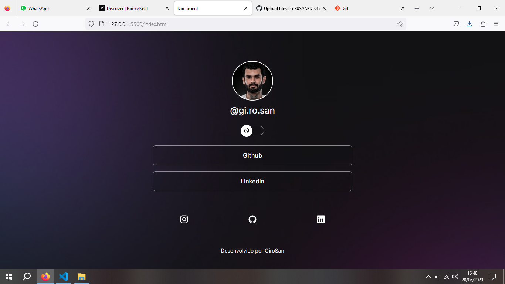

<h1 align=center>Projeto DevLinks</h1>

Projeto desenvolvido seguindo o curso Discover da escola RocketSeat.

 
 </img>
 

Neste projeto, foi desenvolvido um projeto onde foram utilizados HTML, CSS e JavaScript. O design do projeto foi desenvolviido pela escola, e utilizamos o Figma. 

